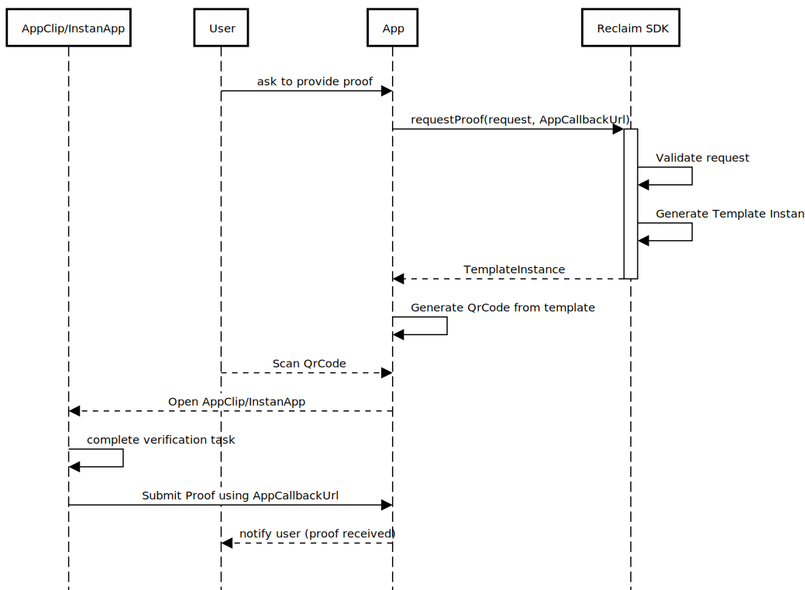

# Reclaim SDK v2

Designed to request proofs from the Reclaim protocol and manage the flow of claims and witness interactions.

## Interfaces:

- ### Reclaim Interface

  - #### `requestProof(request: ProofRequest, AppCallbackUrl: string): Template`

    Requests proof using the provided proof request.

    **Parameters:**

    - `request`: ProofRequest (The proof request object)
    - `AppCallbackUrl`: callback url which will receive the proof from AppClip/InstantApp

    **Returns:**

    - `Template`: A template instance based on the proof request.

- **ProofRequest Interface:**

  - **title:** `string` - Title of the request
  - **baseCallbackUrl:** `string` - Base callback URL
  - **requestedProofs:** `HttpsProvider[]` - Proofs requested by the application
  - **callbackId?:** `string` - Callback ID
  - **contextMessage?:** `string` - Context message for the proof request
  - **contextAddress?:** `string` - Context address for the proof request
  - **requestorAddress?:** `string` - Master wallet address of the requestor
  - **requestorPublicKey?:** `string` - Ephemeral public key of the requestor

- **Template Interface:**

  - **id:** `string`
  - **sessionId:** `string`
  - **name:** `string`
  - **callbackUrl:** `string`
  - **claims:** `Claim[]`
  - **requestorAddress?:** `string`
  - **requestorPublicKey?:** `string`

- **Claim Interface:**
  - **templateClaimId:** `string`
  - **context:** `string`
  - **provider:** `ProviderParams`

## Usage Flow

## Dependency Diagram

## Error Codes

- `Malformed proof request`: The proof request is structurally incorrect or missing required elements.

- `Invalid AppCallbackUrl format`: The provided AppCallbackUrl is not in the expected format.
