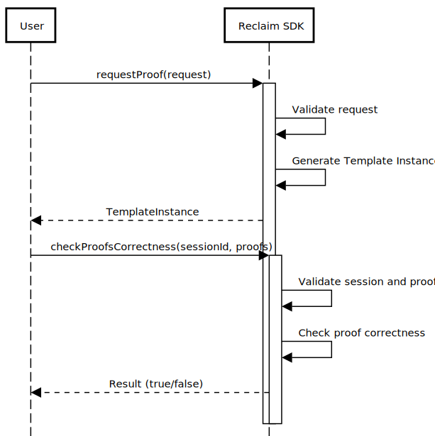

# Reclaim SDK v2

Designed to request proofs from the Reclaim protocol, verify the correctness of submitted proofs, and manage the flow of claims and witness interactions.

## Interfaces:

```typescript
interface Reclaim {
  /**
   * Requests proof using the provided proof request.
   * @param request - The proof request object.
   * @returns A template instance based on the proof request.
   */
  requestProof(request: ProofRequest): Template

  /**
   * Checks the correctness of proofs submitted for a given session.
   * @param sessionId - The identifier for the session.
   * @param proofs - An array of proof objects.
   * @returns True if proofs are correct, false otherwise.
   */
  checkProofsCorrectness(sessionId: string, proofs: Proof[]): boolean
}
```

## Usage Flow



## Dependency Diagram


## Error Codes

- `Bad Request`: Invalid request format or parameters.
- `Not Found`: Session or resource not found.
- `Service Unavailable`: Service temporarily unavailable.
